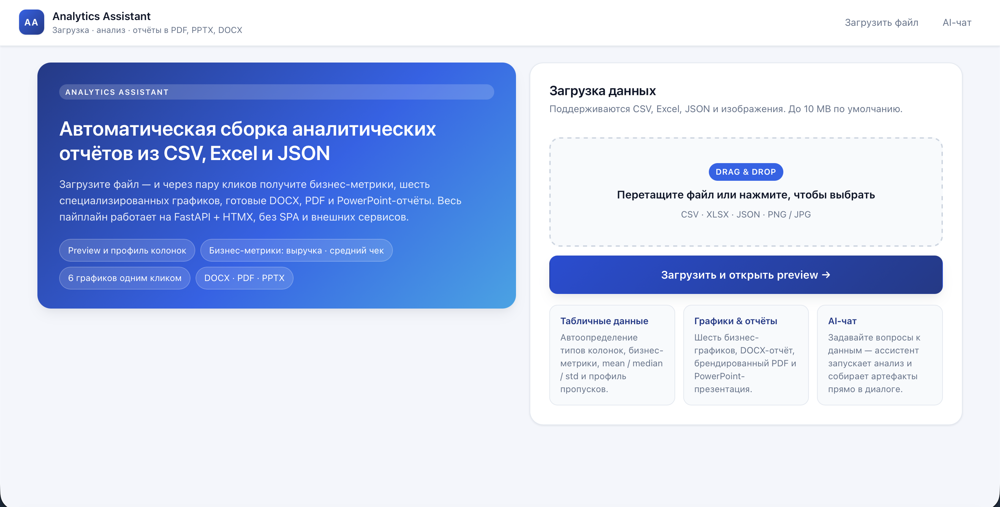
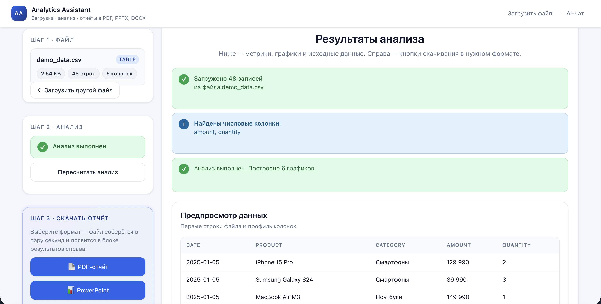
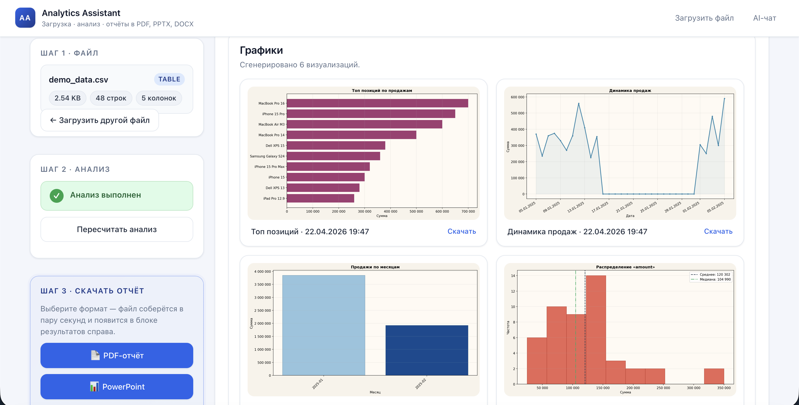
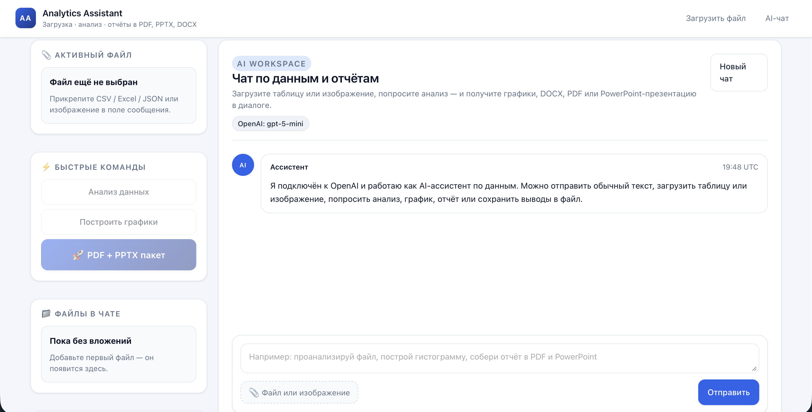
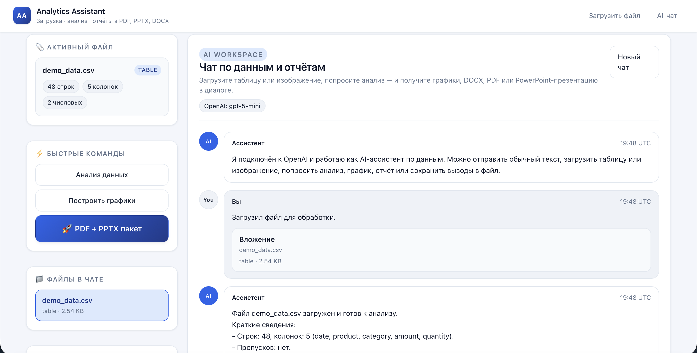
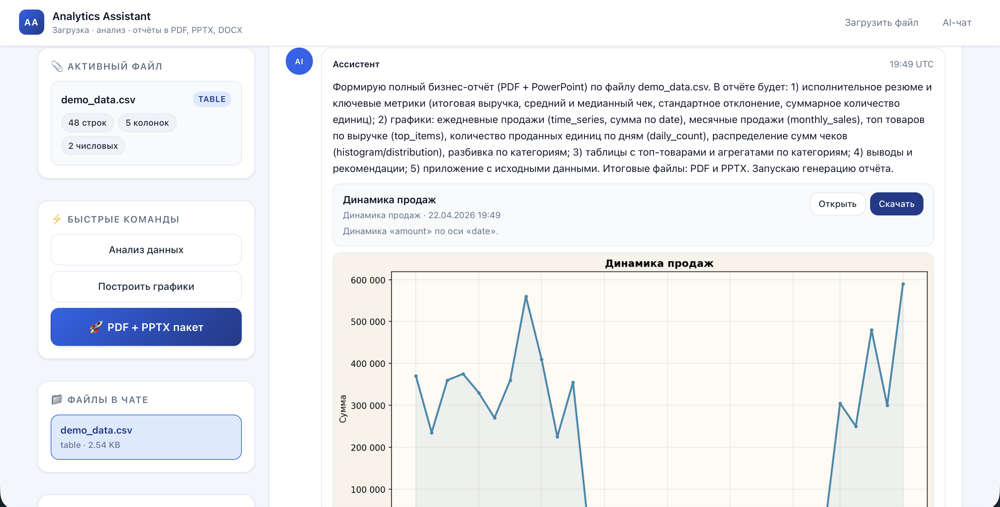
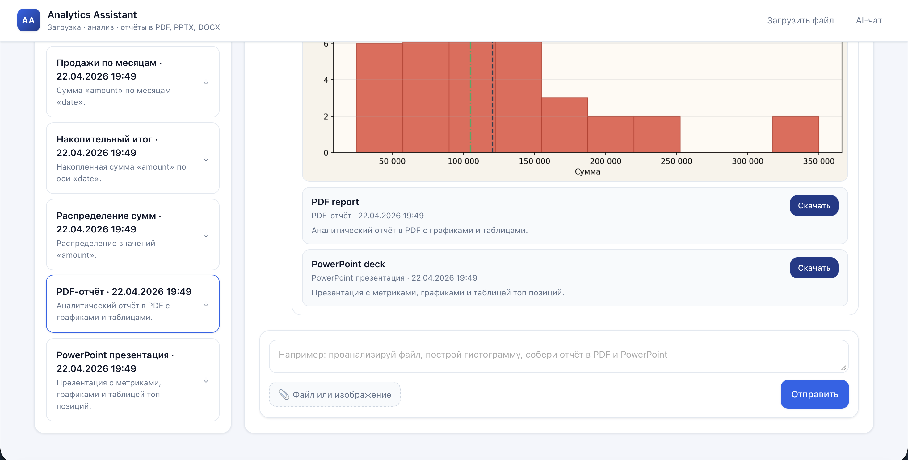

# Analytics Assistant — AI-помощник для аналитических отчётов

Веб-приложение, которое превращает обычную таблицу или картинку в готовый аналитический отчёт: набор графиков, документ Word, PDF и PowerPoint-презентацию. Работать можно мышкой через кнопки или прямо текстом в AI-чате на русском языке.

---

## Задача

У аналитика, маркетолога или предпринимателя часто есть «сырые» выгрузки: таблицы продаж из 1С, отчёты из Amazon, выгрузки CRM. Чтобы показать их руководству или клиенту, нужно:

- посчитать ключевые метрики (выручку, средний чек, топ позиций);
- построить понятные графики;
- собрать всё это в аккуратный документ или презентацию.

Вручную на это уходит от получаса до нескольких часов. Особенно больно, когда формат отчёта нужно менять под каждого получателя: кому-то удобно Word, кому-то PDF, а руководству — слайды.

## Решение

Analytics Assistant берёт на себя всю рутину. Пользователь загружает файл — приложение само определяет, какие в нём колонки (дата, сумма, категория, количество), считает метрики, строит графики и собирает отчёты сразу в трёх форматах. Если хочется уточнений или нестандартной задачи — можно написать запрос в AI-чат обычными словами, и помощник сам выберет нужные действия.

---

## Как это работает

Сценарий максимально короткий — три шага:

1. **Загрузка файла.** На главной странице пользователь перетаскивает CSV, Excel, JSON или картинку в зону загрузки (до 10 МБ).
2. **Анализ.** Одним кликом запускается разбор: приложение показывает, сколько строк и колонок, какие из них числовые, какие текстовые, есть ли пропуски, и рассчитывает бизнес-метрики — сумму, средний чек, количество записей, топ позиций.
3. **Скачивание отчётов.** В правой части экрана появляются кнопки для получения результата: Word, PDF, PowerPoint или весь пакет сразу.

Параллельно доступен **AI-чат**: туда можно загрузить тот же файл и написать, например, «собери полный бизнес-отчёт в PDF и PowerPoint» или «построй динамику продаж и топ позиций» — помощник поймёт запрос и выполнит нужные действия.

### Что получает пользователь на выходе

- **Шесть бизнес-графиков** для таблиц с продажами: динамика по дням, топ позиций, количество по дням, продажи по месяцам, накопительный итог, распределение сумм. Плюс три базовых графика для любых таблиц — линейный, столбчатый и гистограмма.
- **Word-документ** с заголовком, метриками, описанием колонок и всеми графиками — готов к отправке по почте.
- **PDF-отчёт** в брендированном оформлении: титул, блок метрик, графики с подписями, таблицы с топом и выводами.
- **PowerPoint-презентацию** с титульным слайдом, отдельными слайдами под каждую метрику и график, итоговой таблицей топ-позиций.
- **Markdown-резюме** беседы с AI — удобно сохранять в заметки.

Все файлы получают человекочитаемые названия (например, «Динамика продаж · 22.04.2026 19:47»), а время в отчётах указывается в локальном часовом поясе, а не в UTC.

---

## Скриншоты интерфейса

Главная страница — краткое описание продукта и форма загрузки файла:

Страница результатов анализа — слева карточки шагов и кнопки скачивания, справа блок метрик и превью таблицы:

Галерея автоматически построенных графиков с понятными подписями и кнопкой «Скачать»:

AI-чат в пустом состоянии — можно сразу попросить анализ, графики или пакет отчётов:

Тот же чат после загрузки файла: помощник показывает краткую сводку по данным:

Помощник строит график прямо в диалоге и прикрепляет его к сообщению:

Финал диалога: готовые PDF и PowerPoint со ссылками на скачивание, а слева — список всех созданных артефактов:

Примеры готовых отчётов, собранных приложением: [`docs/demo_report.pdf`](docs/demo_report.pdf), [`docs/demo_report.docx`](docs/demo_report.docx), [`docs/demo_presentation.pptx`](docs/demo_presentation.pptx).

---

## Стек технологий

Каждый инструмент решает конкретную задачу.

**Язык и среда**

- **Python 3.11** — основной язык. На нём написана вся серверная логика: анализ данных, построение графиков, сборка документов.
- **Docker и Docker Compose** — упаковка приложения в контейнер вместе с системными зависимостями (для PDF нужны библиотеки шрифтов и графики). Запуск в одну команду, одинаковое поведение на любой машине.

**Веб-приложение**

- **FastAPI** — основа бэкенда. Принимает загрузку файлов, отдаёт страницы, обрабатывает действия пользователя и запросы к AI.
- **Uvicorn** — сервер, на котором работает FastAPI.
- **Jinja2** — шаблонизатор. Из него собираются HTML-страницы интерфейса и HTML-шаблон для PDF-отчётов.
- **HTMX** — лёгкая замена SPA. Позволяет обновлять отдельные куски страницы (превью файла, результаты анализа, сообщения чата) без полной перезагрузки и без написания клиентского фреймворка.
- **python-multipart** — обработка загрузки файлов из формы.
- **python-dotenv** — чтение настроек (ключ OpenAI, часовой пояс) из файла `.env`.

**Работа с данными**

- **Pandas** — чтение и анализ таблиц (CSV, Excel, JSON), подсчёт метрик, автоопределение типов колонок, группировки для графиков.
- **NumPy** — вспомогательные математические операции: средние, медианы, стандартные отклонения.
- **openpyxl** — чтение Excel-файлов (`.xlsx`).
- **Pillow** — работа с изображениями, если пользователь загружает картинку вместо таблицы.

**Графики**

- **Matplotlib** — построение всех девяти типов графиков (шесть бизнес-графиков и три базовых). Результат сохраняется как PNG и затем встраивается в отчёты.

**Генерация отчётов**

- **python-docx** — сборка Word-документа: заголовки, метрики, описание колонок, графики с подписями.
- **WeasyPrint** (в связке с **pydyf**) — превращает HTML-шаблон в PDF. Удобно: дизайн описывается как обычная веб-страница с CSS.
- **python-pptx** — сборка PowerPoint-презентации: титул, слайды с метриками и графиками, итоговая таблица.
- **tzdata** — база часовых поясов, чтобы даты в отчётах показывались по локальному времени пользователя даже внутри Docker-контейнера.

**AI-слой**

- **OpenAI SDK** — подключение к модели (по умолчанию `gpt-5-mini`). Чат понимает запросы на естественном языке и выдаёт структурированные команды, которые сервер уже выполняет (построй график, собери PDF, сохрани выводы). Если ключ OpenAI не задан, приложение не падает: включается локальный запасной разбор по ключевым словам.

---

## Структура проекта

Коротко, где что лежит:

- `app/` — серверная часть: настройки, маршруты страниц, маршруты действий и сервисы (файлы, анализ, графики, отчёты, чат, AI).
- `templates/` — HTML-шаблоны главной страницы, страницы результатов, AI-чата и шаблон для PDF.
- `static/` — стили и скрипты для интерфейса.
- `demo/` — готовые демо-данные (CSV и JSON) — можно сразу загрузить и попробовать.
- `docs/` — скриншоты, обложки, примеры готовых отчётов.
- `storage/` — рабочая папка: сюда временно сохраняются загруженные файлы и собранные отчёты.
- `Dockerfile` и `docker-compose.yml` — описание контейнера для запуска.
- `requirements.txt` — список Python-библиотек.
- `.env.example` — шаблон настроек (ключ OpenAI, модель, часовой пояс).

---

## Запуск

Есть два способа — оба одинаково простые.

**Через Docker (рекомендуется).** Нужен только установленный Docker Desktop. В папке проекта копируется `.env.example` в `.env` (при желании туда вписывается ключ OpenAI), запускается одна команда `docker compose up --build`, после чего приложение открывается по адресу `http://localhost:8000`. Все системные библиотеки для PDF уже в образе.

**Локально.** Создаётся виртуальное окружение Python 3.11, ставятся зависимости из `requirements.txt`, дополнительно устанавливаются системные библиотеки для WeasyPrint (на macOS — через Homebrew, на Ubuntu — через apt), копируется `.env.example` в `.env`, запускается Uvicorn.

Если ключ OpenAI не указан, приложение продолжит работать: чат переключится на локальный разбор команд по ключевым словам, все кнопки интерфейса по-прежнему функциональны.

---

## Демо-данные

В папке `demo/` лежат готовые примеры в форматах CSV и JSON — выгрузка в стиле Amazon-продаж. Достаточно загрузить любой из файлов и нажать «Запустить анализ» (или написать в чат «собери бизнес-пакет») — и через несколько секунд получится полный комплект: шесть графиков, PDF-отчёт и PowerPoint-презентация.

---

## Планы развития

- Планировщик для автоматических рассылок готовых отчётов на почту.
- Подключение локальной модели (Ollama, llama.cpp) как альтернативы OpenAI.
- Прямая загрузка данных из баз (PostgreSQL, ClickHouse) — без выгрузки в файл.

---

© Tatiana · Кейс для портфолио
